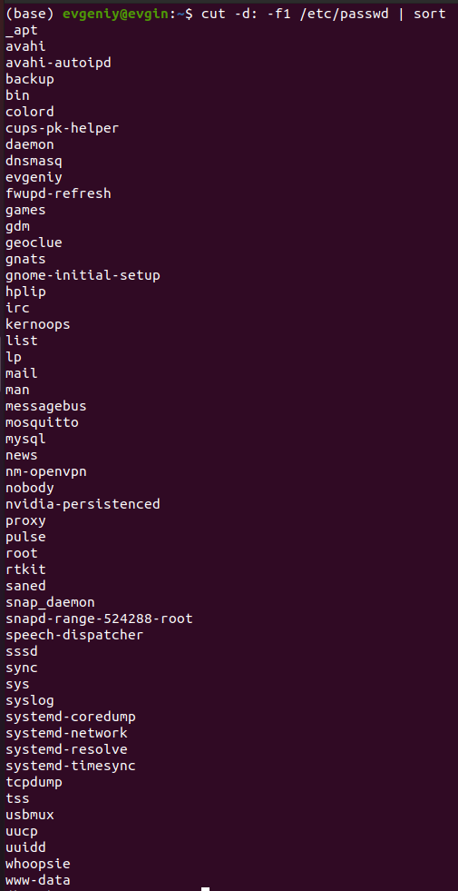
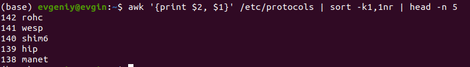
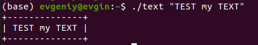
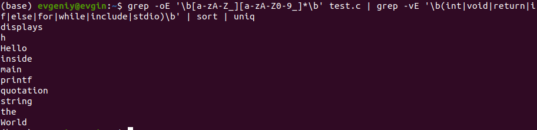
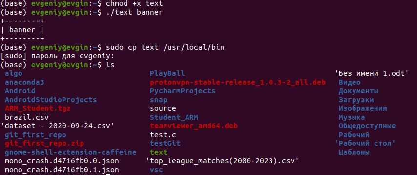
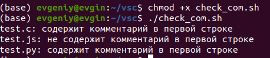
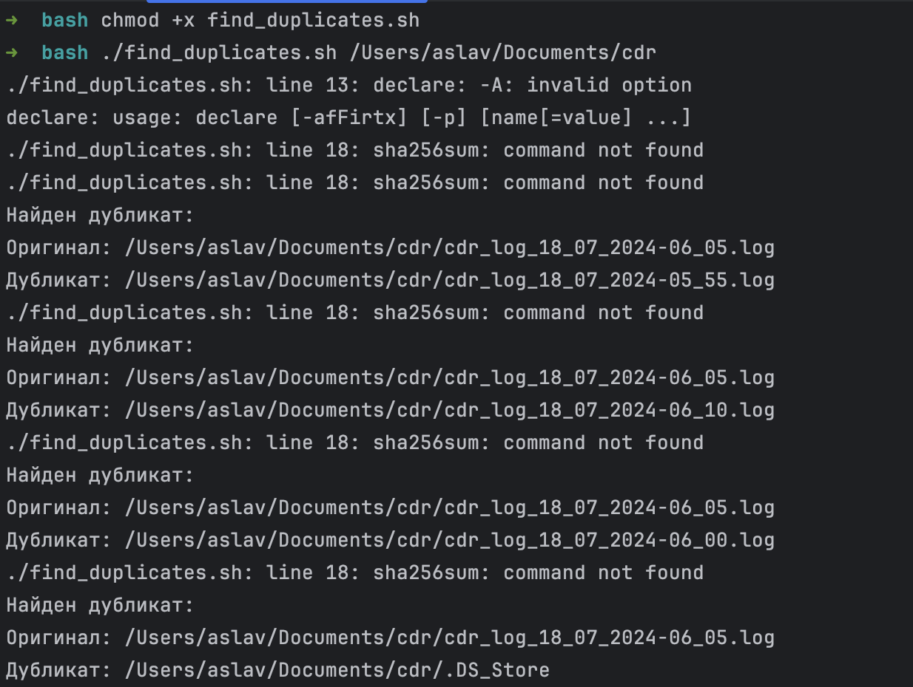
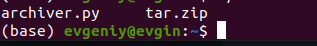
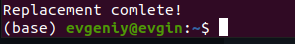
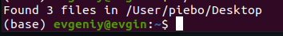

# Практическое занятие №1. Введение, основы работы в командной строке


## Задача 1
```cut -d: -f1 /etc/passwd |sort```



## Задача 2
```awk '{print $2, $1}' /etc/protocols | sort -k1,1nr | head -n 5```



## Задача 3
```
#!/bin/bash

if [ $# -eq 0 ]; then
    echo "Использование: $0 \"Ваш текст\""
    exit 1
fi

text="$1"

length=${#text}

border=$(printf "%0.s-" $(seq 1 $((length + 2))))

border="+$border+"

echo "$border"
echo "| $text |"
echo "$border"
```            



## Задача 4
```
grep -oE '\b[a-zA-Z_][a-zA-Z0-9_]*\b' test.c | grep -vE '\b(int|void|return|if|else|for|while|include|stdio)\b' | sort | uniq
```



## Задача 5
```
chmod +x reg
sudo cp $1 /usr/local/bin
```




## Задача 6
```
chmod +x check_comment.sh
./check_comment.sh
```




## Задача 7
```
chmod +x find_duplicates.sh
./find_duplicates.sh /Users/aslav/Documents/cdr
```




## Задача 8
```
go run archiver.go /Users/aslav/Documents/cdr  .log
```



## Задача 9
```
cd code
go run replacer.go /Users/aslav/Desktop/RTU_MIREA_2COURCE/КонфигУправ/1Pract/trash/testFor8.txt testFor8output.txt

```




## Задача 10
```
cd code
go run dirReader.go /Users/aslav/Downloads 
```


